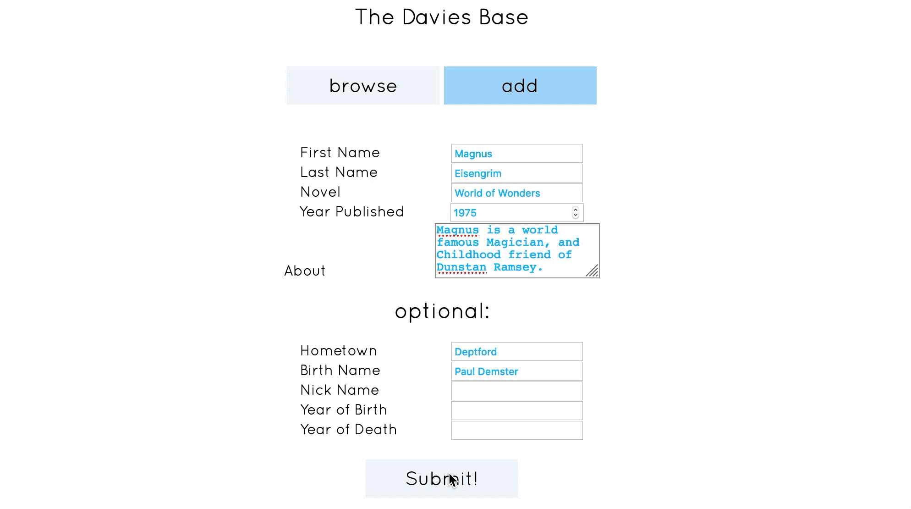

# Davies Base

Davies Base will soon be the definitive searchable database for Characters from all of Robertson Davies Novels. It consumes data from [this API.](https://github.com/TYLER-JM/davies_characters)

## Tech Stack
- Vue.js (Single File Components)
- The API is built with CodeIgniter for PHP
- Webpack, babel

## Current Features:
1. Add a character to the database.
2. Search for a character in the database.
3. View the information of a single character.
#### Coming Soon:
4. Delete a character from the database.
5. Search alphabetically, or by novel. In Addition to searching by name.
6. Edit the information associated with a character.

### Current Look:

--- 
### Dependencies
- webpack
- webpack-dev-server
- vue
- vue-loader
- vue-template-compiler
- Axios
- @babel/core
- Lodash

---
## Setup

1. Setup the database and API [from my other repository.](https://github.com/TYLER-JM/davies_characters)

2. Once that's set up, fork, clone, or download this repository.

3. use `npm install` to install the dependencies

4. Make sure the string returned by the `returnURL` function (*src/components/helpers/returnURL.js*) matches your local environment. It should end with `davies_characters/index.php/characters`

5. use `npm run start` to open the page from localhost:8080

