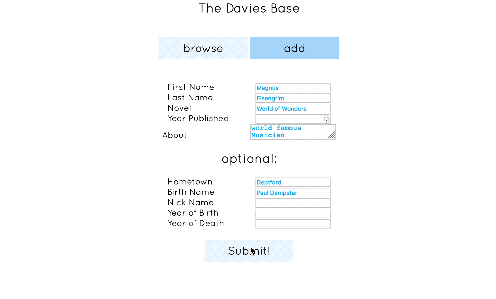

# Davies Base

Davies Base will soon be the definitive searchable database for Characters from all of Robertson Davies Novels. It consumes data from [this API.](https://github.com/TYLER-JM/davies_characters)

## Tech Stack
- Webpack
- Vue.js (Single File Components)
- The API is built with CodeIgniter for PHP

## Current Features:
1. Add a character to the database.
2. Search for a character in the database.
3. View the information of a single character.
#### Coming Soon:
4. Delete a player from the database.
5. Search alphabetically, or by novel. In Addition to searching by name.
6. Edit the information associated with a character.

### Current Look:

--- 
### Dependencies
- css-loader
- file-loader (to load the font)
- style-loader
- webpack
- webpack-cli
- webpack-dev-server
- vue
- vue-loader
- vue-template-compiler
- html-webpack-plugin
- clean-webpack-plugin
- Axios
